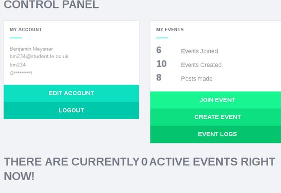
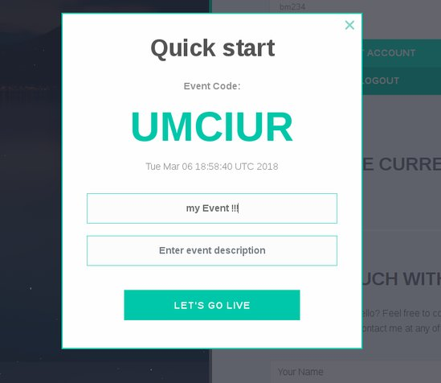
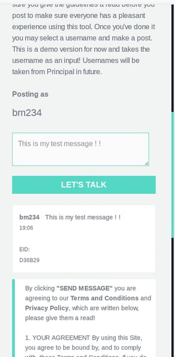

### Talkble - A web application designed to improve the effeciency of teaching and the experience of learning ###

`mvn package` then `mvn spring-boot:Run`

## What can it do?

 - Uses Bootstrap for responsiveness / mobile friendly
 - Facilitates quick register and login 
 - Creating events is easy, just **click** and **go**. Event creators are provided with a 6 character event identifier acting as a joining key.
 - Users can join from the home page using the event ID, includes some neat features to provide a better user experience.
 - Messages are sent in real-time to all connected users using Web Socket's.
 - Personal warnings for messages containing any profanity, or spam messages, messages under a character threshold.
 - Added scheduled task to normalise event status, check whether the event should be set to inactive due to lack of activity.
 - Disconnects all users if event becomes inactive, or the creator ends the event.
 - User statistics and personal log

